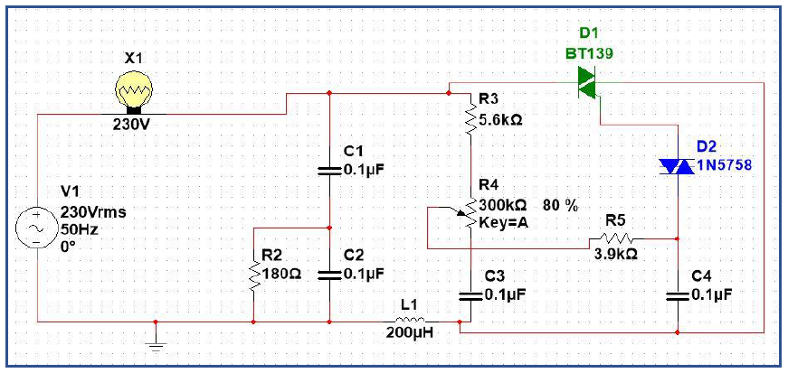
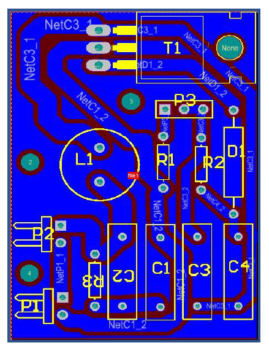
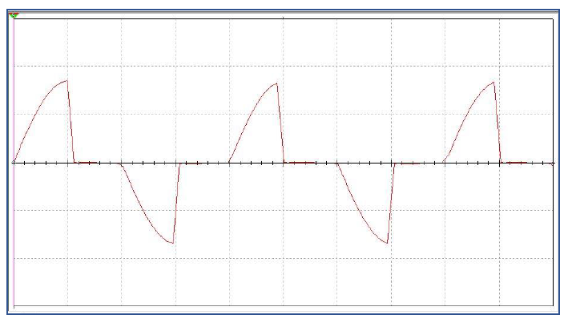
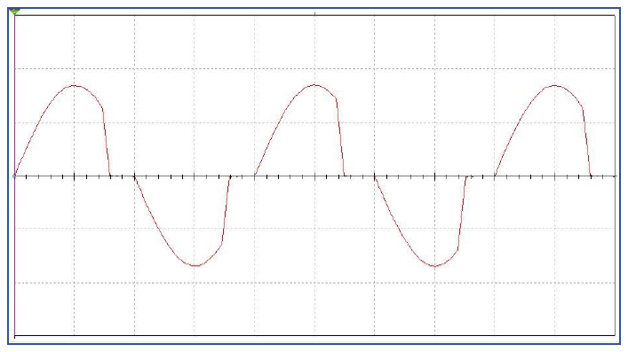
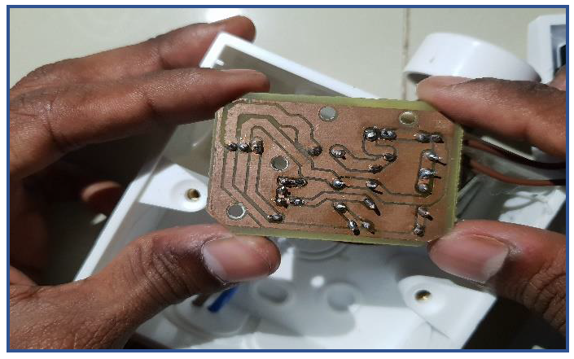
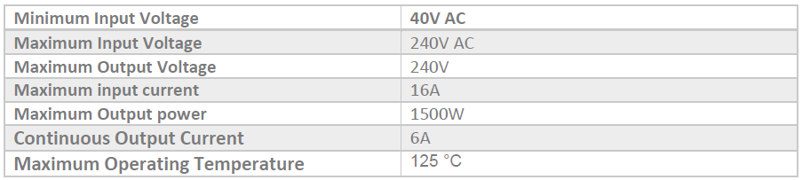

# AC Drill Speed Controller

* [About the Project](#about-the-project)
* [Process](#process)
  * [Schematic Diagram](#schematic-diagram)
  * [PCB Layout](#pcb-layout)
  * [WaveForms](#waveforms)
  * [Soldered PCB](#soldered-pcb)
  * [Specs](#specs)
* [Acknowledgements](#acknowledgements)

## About the Project

There are situations where we need to control the speed of an electrical drill. Sometimes But we can’t find such appliances in the market. The inability of choosing the correct speed of the drill can cause problems such as damaging of the drilling material and drill bit. This provokes the need for a manual speed controlling of the electric drill.
The proposed solution for the problem we identified is a product that can adjust the output AC power. We designed and built a circuit that can be used for this task and included it in a power socket. This power socket takes input AC power from the main supply. Also, we fixed an adjustable inbuilt knob to this socket so that we can control the amount of AC power flowing out.
When we use appliances like drill machines, the speed of the motor can be slowed down due to the friction/hardness of the drilled object. The speciality in the circuit we designed is, in instances like this it auto stabilizes and make sure that the speed remains the same.

## Process

Here are all related processes and works of hte controller

### Schematic Diagram

### PCB Layout

### WaveForms
These are the simulation results for two different resistance values.

#### Output waveform for lower resistance value

#### Output waveform for higher resistance value

### Soldered PCB

### Specs

